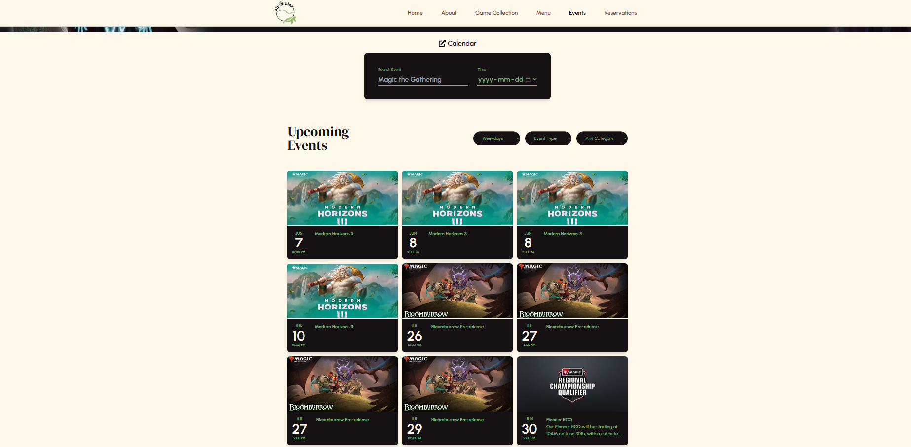

# Sip & Play Redesign

Welcome to the Sip & Play Redesign repository! This project aims to revamp the Sip & Play website, enhancing its speed, design, and content management capabilities.

## Team

- **Alex**: [LinkedIn](https://www.linkedin.com/in/alexandershen2004/)
- **Julian**: [LinkedIn](https://www.linkedin.com/in/jatkindev/)
- **Leeanna**

## Repositories

- **Next.js Frontend**: [GitHub](https://github.com/AlexShen101/codedex-hackathon)
- **Strapi Backend**: [GitHub](https://github.com/jmdatkin/codedex-hackathon-strapi)

## Live Demo

Check out our live demo: [Sip & Play Redesign](https://codedex-hackathon-sip-n-play.vercel.app/)

<a href="https://codedex-hackathon-sip-n-play.vercel.app/">

</a>


## Project Overview

Greetings, hackathon organizers!

For our project, we aimed to overhaul Sip & Play’s site to enhance its speed, streamline its design, and integrate it with a CMS to allow the owners to easily add new content.

### Tech Stack

- **Frontend**: [](https://nextjs.org/)
- **Backend**: [](https://strapi.io/)
- **Styling**: [](https://tailwindcss.com/)
- **Deployment**: [](https://vercel.com/)

### Why Next.js and Strapi?
- Next.js: Chosen for its speed, flexibility, server-side rendering, static site generation, and SEO optimization.
- Strapi: Provides a user-friendly admin dashboard for content management and supports RESTful API queries.

### Design and Development Process
We began the hackathon by creating a design using Figma, inspired by boba, board games, and the calming ambiance of the cafe. Leeanna led the design process, conducting thorough research on the existing website, crafting detailed wireframes, and selecting image assets.

Julian set up Strapi, defining the database structure based on the current website's content. This allowed new content to be added via Strapi's admin dashboard, enabling the Next.js app to fetch and display updated content dynamically. After that, Julian and I worked on implementing the feature of our app!

### Features Implemented
- Event calendar
- Detailed events view
- Games page
- Custom 3D models integrated with Three.js for a personalized touch

### Reflections
This hackathon was an awesome experience! A huge thank you to my team members for their hard work and to Codedex and all organizers and volunteers for making this event possible. Looking forward to more events like this in the future! 🔥

## Getting Started

This project requires npm version 18.19!

### Installation

First, install dependencies:

```bash
npm install
# or
yarn
```

### Development Server

Run the development server:

```bash
npm run dev
# or
yarn dev
```

Open [http://localhost:3000](http://localhost:3000) with your browser to see the result.

---


